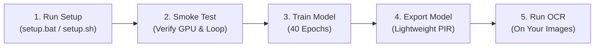

# Kurdish OCR Recognition Fine-Tuning (PaddleOCR)

A simple, production-ready framework to fine-tune **PaddleOCR v5** on Kurdish text (**Sorani** Arabic-script and **Kurmanji** Latin-script).

Works out of the box on **Windows**, **Linux**, and **Google Colab Free GPU**.

---

## What Should I Do? (Step-by-Step Guide)

Follow these simple steps from start to finish:



---

### Step 1: Install Everything (1-Click)

> [!IMPORTANT]
> **Prerequisites**: Ensure you have 64-bit **Python 3.10, 3.11, or 3.12** installed (PaddlePaddle 3.3.1 does not have wheels for Python 3.13 yet). If you have an NVIDIA GPU, `setup.bat` automatically detects your GPU and installs GPU-accelerated PaddlePaddle.

Clone the repo and run the setup script for your OS:

- **On Windows**:
  Double-click `setup.bat` or run in terminal:
  ```cmd
  setup.bat
  ```

- **On Linux / WSL / Google Colab**:
  ```bash
  bash scripts/setup.sh
  ```

- **Or Using Python Directly**:
  ```bash
  python main.py setup
  ```

> **What this does automatically:**
> 1. Creates a Python virtual environment (`.venv`).
> 2. Detects your hardware (NVIDIA GPU with CUDA 12.x/11.x, or CPU) and installs the right PaddlePaddle build.
> 3. Clones the official PaddleOCR repository.
> 4. Downloads official `arabic_PP-OCRv5_mobile_rec` base model weights.
> 5. Downloads and extracts the 162,000+ Kurdish dataset from Hugging Face into `data/kurdish_rec/`.
> 6. Runs a full environment verification.

---

### Step 2: Verify Your Hardware (5 Seconds)

Run a quick hardware check to make sure your GPU, VRAM, and gradient loop work:

```bash
python main.py smoke-test
```

If you see `ALL SMOKE TEST CHECKS PASSED`, you're ready to train!

---

### Step 3: (Optional) Run a Quick Pilot Test

Before doing the long training run, test convergence on a small subset (500 samples, 2 epochs, takes ~1 minute):

```bash
python main.py pilot-run --num-samples 500 --max-epochs 2
```

This verifies that loss decreases and checkpoints save properly.

---

### Step 4: Fine-Tune the Full Model

Start the production training run on the entire Kurdish dataset:

```bash
python main.py train --epochs 40
```

> **Note on Training Settings:**
> - Batch size is **automatically calculated** based on your GPU VRAM (e.g. 384 on 6 GB+, 128 on 4 GB, 16 on CPU).
> - Mixed Precision (`amp_level: "O2"`) is enabled automatically on GPUs to double speed and cut memory usage in half.
> - Checkpoints are saved automatically to `output/production_run/checkpoints/` (`best_accuracy.pdparams` and `latest.pdparams`).

---

### Step 5: Export the Trained Model

When training is complete, export the best checkpoint into lightweight deployment format:

```bash
python main.py export
```

The exported model is saved in `export/kurdish_final/`:
- `inference.json` (model architecture)
- `inference.pdiparams` (model weights)
- `inference.yml` (configuration)
- `arabic_kurdish_dict.txt` (747-character dictionary)

---

### Step 6: Test Recognition on Images

#### 1. Test on random test images with ground-truth comparison:
```bash
python main.py infer --split test --count 5
```

#### 2. Recognize Kurdish text on your own image:
```bash
python main.py infer --image path/to/your_image.jpg
```

#### 3. Use in your own Python project:
```python
from pathlib import Path
from scripts.lib.recognizer import Recognizer

# Load the exported Kurdish model
recognizer = Recognizer(model_dir=Path("export/kurdish_final"), use_gpu=True)

# Run prediction
predictions, timing = recognizer.predict_paths([Path("my_kurdish_text.jpg")])

for pred in predictions:
    print(f"Recognized Kurdish Text: {pred.text} (Confidence: {pred.score:.4f})")
```

---

## Running on Google Colab (Free T4 GPU)

You can train completely for free on Google Colab:

1. Open Google Colab, go to **Runtime** → **Change runtime type** → select **T4 GPU**.
2. Run these cells in order:

```bash
# 1. Clone repository
!git clone https://github.com/a7x3a/qai-paddle-ocr-finetuning.git
%cd qai-paddle-ocr-finetuning

# 2. Setup (installs GPU packages, downloads base model and dataset)
!bash scripts/setup.sh

# 3. Train the model
!python main.py train --epochs 40

# 4. Export model
!python main.py export
```

---

## All Commands Cheat Sheet

| Task | Command |
| :--- | :--- |
| **Setup everything** | `setup.bat` (Windows) or `bash scripts/setup.sh` (Linux/Colab) |
| **Verify setup** | `python main.py smoke-test` |
| **Measure zero-shot baseline** | `python main.py benchmark-base --max-samples 100` |
| **Mini pilot test (1 min)** | `python main.py pilot-run --num-samples 500 --max-epochs 2` |
| **Full training (40 epochs)** | `python main.py train --epochs 40` |
| **Evaluate all checkpoints** | `python main.py benchmark-all` |
| **Export for deployment** | `python main.py export` |
| **Test on sample images** | `python main.py infer --split test --count 5` |
| **Test on custom image** | `python main.py infer --image path/to/sample.png` |

---

## Why This Works (Model & Data Highlights)

- **Official Model**: Based on official `arabic_PP-OCRv5_mobile_rec` (PPLCNetV3 backbone + SVTR neck + MultiHead CTC/NRTR).
- **Zero Catastrophic Forgetting**: Preserves all 747 base characters (Arabic, English, Persian, 0-9 digits, numerals, punctuation). CTC head matches `[749, 120]` byte-for-byte with 0 re-initialization.
- **100% Character Coverage**: Verified against all 162,000+ Kurdish samples in `a7x3a/qai-ocr-v1-small` with 0 missing characters.
- **Correct Right-to-Left (RTL) Order**: Automatically reverses visual order to proper logical Unicode for Kurdish and Arabic script.

---

## Common Questions & Troubleshooting

- **PowerShell error `running scripts is disabled` on Windows?**
  Run `setup.bat` instead. It automatically bypasses execution restrictions.
- **cuDNN warning `installed Paddle is compiled with CUDNN 9.9, but CUDNN version in your machine is 9.5`?**
  This warning is cosmetic and expected from PaddlePaddle 3.3.1. Training and inference run 100% correctly.
- **GPU Out-Of-Memory (OOM)?**
  The script automatically picks a safe batch size for your VRAM. If you want to force a smaller batch size, simply add `--batch-size 64` or `--batch-size 32`:
  ```bash
  python main.py train --batch-size 64
  ```
