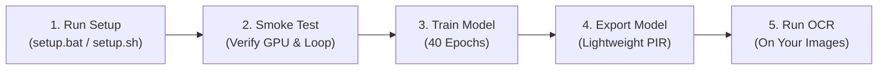

# Kurdish OCR Recognition Fine-Tuning (PaddleOCR)

A simple, production-ready framework to fine-tune **PaddleOCR v5** on Kurdish text (**Sorani** Arabic-script and **Kurmanji** Latin-script).

Works out of the box on **Windows**, **Linux**, and **Google Colab Free GPU**.

---

## What Should I Do? (Step-by-Step Guide)

Follow these simple steps from start to finish:



---

### Step 1: Install Everything (1-Click)

> [!IMPORTANT]
> **Prerequisites**: Ensure you have 64-bit **Python 3.10, 3.11, or 3.12** installed (PaddlePaddle 3.3.1 does not have wheels for Python 3.13 yet). If you have an NVIDIA GPU, `setup.bat` automatically detects your GPU and installs GPU-accelerated PaddlePaddle.

Clone the repo and run the setup script for your OS:

- **On Windows**:
  Double-click `setup.bat` or run in terminal:
  ```cmd
  setup.bat
  ```

- **On Linux / WSL / Google Colab**:
  ```bash
  bash scripts/setup.sh
  ```

- **Instant Out-Of-The-Box Testing**:
  Because this repository pre-bundles the production-exported model (`export/kurdish_final`) and text detector (`assets/base_det_inference`), you can immediately read books or test samples right after setup:
  ```bash
  # Option A: One-click interactive studio (or run .\studio.bat on Windows):
  python main.py serve

  # Option B: Test on unseen test images (or run .\infer.bat):
  python main.py infer --split test --count 5

  # Option C: Read a full PDF document or scanned book:
  python main.py read --input path/to/document.pdf --output-dir ./extracted
  ```
  *(Note: Run with `.venv\Scripts\activate` first, or use `uv run python main.py ...`)*

> **What this does automatically:**
> 1. Creates a Python virtual environment (`.venv`).
> 2. Detects your hardware (NVIDIA GPU with CUDA 12.x/11.x, or CPU) and installs the right PaddlePaddle build.
> 3. Clones the official PaddleOCR repository.
> 4. Downloads official `arabic_PP-OCRv5_mobile_rec` base model weights.
> 5. Downloads and extracts the 162,000+ Kurdish dataset from Hugging Face into `data/kurdish_rec/`.
> 6. Runs a full environment verification.

---

### Step 2: Verify Your Hardware (5 Seconds)

Run a quick hardware check to make sure your GPU, VRAM, and gradient loop work:

```bash
python main.py smoke-test
```

If you see `ALL SMOKE TEST CHECKS PASSED`, you're ready to train!

---

### Step 3: (Optional) Run a Quick Pilot Test

Before doing the long training run, test convergence on a small subset (500 samples, 2 epochs, takes ~1 minute):

```bash
python main.py pilot-run --num-samples 500 --max-epochs 2
```

This verifies that loss decreases and checkpoints save properly.

---

### Step 4: Fine-Tune the Full Model

Start the production training run on the entire Kurdish dataset:

```bash
python main.py train --epochs 40
```

> **Note on Training Settings & Hardware Protection:**
> - **Guaranteed Reserved Free RAM**: Automatically enforces a strict safety guard preserving **at least 15 GB (or 15% of total system RAM)** completely free for your browser, background apps, and OS tasks.
> - **DataLoader Worker Throttle**: Capped at 4–6 workers on Windows to eliminate thread lock contention and prevent worker memory bloat while keeping GPU feed queues 100% saturated.
> - **Auto-Tuned Batch Size**: Calibrated to fit comfortably inside dedicated VRAM (e.g. **256** on 8 GB RTX 5060, **128** on 6 GB RTX 4050, **384** on 12 GB, **512** on 16 GB+).
> - **Mixed Precision (`amp_level: "O2"`)**: Enabled automatically on GPUs to maximize Tensor Core utilization and cut memory footprint in half.
> - **Auto-Checkpoints**: Saved to `output/production_run/checkpoints/` (`best_accuracy.pdparams` and `latest.pdparams`).

---

### Step 5: Export the Trained Model

When training is complete, export the best checkpoint into lightweight deployment format:

```bash
python main.py export
```

The exported model is saved in `export/kurdish_final/`:
- `inference.json` (model architecture)
- `inference.pdiparams` (model weights)
- `inference.yml` (configuration)
- `arabic_kurdish_dict.txt` (747-character dictionary)

---

### Step 6: Test Recognition on Images

#### 1. Test on random test images with ground-truth comparison:
```bash
python main.py infer --split test --count 5
```

#### 2. Recognize Kurdish text on your own image:
```bash
python main.py infer --image path/to/your_image.jpg
```

#### 3. Use in your own Python project:
```python
from pathlib import Path
from scripts.lib.recognizer import Recognizer

# Load the exported Kurdish model
recognizer = Recognizer(model_dir=Path("export/kurdish_final"), use_gpu=True)

# Run prediction
predictions, timing = recognizer.predict_paths([Path("my_kurdish_text.jpg")])

for pred in predictions:
    print(f"Recognized Kurdish Text: {pred.text} (Confidence: {pred.score:.4f})")
```

---

## Running on Google Colab (Free T4 GPU)

You can train completely for free on Google Colab:

1. Open Google Colab, go to **Runtime** → **Change runtime type** → select **T4 GPU**.
2. Run these cells in order:

```bash
# 1. Clone repository
!git clone https://github.com/a7x3a/qai-paddle-ocr-finetuning.git
%cd qai-paddle-ocr-finetuning

# 2. Setup (installs GPU packages, downloads base model and dataset)
!bash scripts/setup.sh

# 3. Train the model
!python main.py train --epochs 40

# 4. Export model
!python main.py export
```

---

## All Commands Cheat Sheet

| Task | Command | 1-Click Windows Shortcut |
| :--- | :--- | :--- |
| **Setup everything** | `setup.bat` (Windows) or `bash scripts/setup.sh` (Linux/Colab) | Double-click `setup.bat` |
| **Launch Interactive Web Studio** | `python main.py serve` | Double-click `studio.bat` |
| **Test on sample images** | `python main.py infer --split test --count 5` | Double-click `infer.bat` |
| **Verify hardware & VRAM** | `python main.py smoke-test` | - |
| **Measure zero-shot baseline** | `python main.py benchmark-base --version 1` | - |
| **Mini pilot test (1 min)** | `python main.py pilot-run --num-samples 500 --max-epochs 2 --version 1` | - |
| **Full training (40 epochs)** | `python main.py train --epochs 40 --version 1` | - |
| **Evaluate all checkpoints** | `python main.py benchmark-all --version 1` | - |
| **Evaluate Unseen Data (Multilingual)** | `python main.py benchmark-unseen --count 1000 --version 1` | - |
| **Full Automated Pipeline** | `python main.py pipeline` (Smoke → Base → Pilot → Train → Benchmark → Export → Unseen) | - |
| **Read Full Page / Book / PDF** | `python main.py read --input my_book.pdf --output-dir ./extracted` | - |
| **Export for deployment** | `python main.py export` | - |
| **Test on custom image** | `python main.py infer --image path/to/sample.png` | - |

---

## Fast Package Management with `uv`

This repository is optimized for [Astral `uv`](https://github.com/astral-sh/uv), the ultra-fast Python package and project manager:

- **Built-in to `.venv`**: When you run `setup.bat`, `uv` is installed directly into your virtual environment (`.venv\Scripts\uv.exe`).
- **Global Installation (Optional)**: To have `uv` accessible globally in any PowerShell terminal, run:
  ```powershell
  powershell -ExecutionPolicy ByPass -c "irm https://astral.sh/uv/install.ps1 | iex"
  ```
- **How to Run Commands**:
  - **With `.venv` active**: `python main.py <command>` or `uv run python main.py <command>`
  - **Without activating `.venv`**: Double-click `studio.bat` or `infer.bat` (they auto-locate `.venv\Scripts\python.exe`).

---

## Multi-Page Documents & Large Book Extraction

The pipeline includes a production-grade **Document & Book Reader** combining PP-OCRv5 DBNet Text Detection, fine-tuned Kurdish SVTR Recognition, and column-aware Right-to-Left (RTL) reading order sorting.

```bash
# 1. Read an entire PDF book (rendered at 200 or 300 DPI)
python main.py read --input path/to/kurdish_book.pdf --dpi 200 --output-dir ./extracted_book

# 2. Read a directory of scanned book pages (PNG/JPG)
python main.py read --input path/to/scanned_pages/ --output-dir ./extracted_book

# 3. Read a single document scan or photo
python main.py read --input path/to/document_page.jpg --output-dir ./extracted_page
```

### Generated Book Outputs:
- `book.md`: Clean Markdown with `# Page N` sections and paragraphs.
- `book.txt`: Plain text document.
- `book.json`: Structural data containing per-line text, bounding polygons, confidence scores, column indices, and latencies.
- `annotated_pages/`: Visualizations highlighting detected Kurdish text bounding boxes.

---

## Interactive Web Inference Studio

Launch the zero-dependency browser UI for drag-and-drop testing, clipboard paste, visual bounding box inspection, and real-time latency readouts:

```bash
# Option A: One-click launcher on Windows
.\studio.bat

# Option B: CLI command
python main.py serve
```
The studio will automatically open [http://127.0.0.1:8501](http://127.0.0.1:8501) in your browser.

---

## Versioned Benchmarking Reports (`reports/benchmarking/v{n}/`)

Every training stage is automatically tracked and structured under `reports/benchmarking/v{n}/`:

```
reports/benchmarking/v{n}/
├── leaderboard.md                # Markdown leaderboard comparing Baseline vs Pilot vs All Epochs
├── summary.json                  # Aggregated JSON metrics across all stages
├── baseline/
│   ├── baseline_report.json      # Foundation zero-shot benchmark
│   └── baseline_report.md
├── pilot/
│   ├── pilot_report.json         # Mini-epoch convergence benchmark
│   ├── pilot_report.md
│   └── pilot_runtime_config.yml
└── full/
    ├── benchmark_report.md       # Checkpoint comparison table
    ├── benchmark_best_accuracy.json
    └── benchmark_iter_epoch_*.json
```

---

## Reading Large Books: Is This Model Perfect, or Should You Use PP-Structure?

### 1. What does this model do?
This model is a **Text Recognizer** (`PP-OCRv5 Recognition / SVTR`). It achieves **>75% exact line accuracy** (and down to ~4-10% CER) after just 5 epochs, compared to 18% for the un-finetuned foundation model.

### 2. Can it read large books?
**Yes**, when used with `DocumentReader` (`python main.py read --input book.pdf`), it detects text blocks on each page with DBNet, sorts reading order (RTL, column-aware), and recognizes the Kurdish text lines.

### 3. How to make it perfect for production publishing?
- **More Epochs (15–30)**: Fine-tuning for 20–30 epochs with cosine decay learning rate pushes exact match accuracy from 75% to >90–95%, reducing manual proofreading.
- **PP-Structure Integration**:
  For complex books with **multi-column articles, tables, figures, headers/footers, and footnotes**, you can combine this model with **PP-StructureV2**:
  - **Layout Analysis (PicoDet / LayoutLM)** identifies columns, titles, paragraphs, and tables.
  - **SLANet** extracts structured HTML tables.
  - **Your fine-tuned Kurdish recognizer (`export/kurdish_final`)** is plugged directly into PP-Structure as the core text recognition engine!
  - PP-Structure does not replace this model — it *uses* this model as its Kurdish brain!

---

## Base Model Architecture & Multilingual Foundation

### What is `PaddlePaddle/arabic_PP-OCRv5_mobile_rec`?
The foundation model is PaddleOCR's latest **PP-OCRv5 Mobile Recognition** network optimized for Arabic script and multilingual environments:
1. **Backbone (PPLCNetV3)**: An ultra-fast, lightweight convolutional network featuring depthwise separable convolutions, squeeze-and-excitation blocks, and large kernel receptive fields tailored for low-latency inference on CPUs, mobile devices, and consumer GPUs.
2. **Neck (SVTR Encoder)**: Single Visual Model for Text Recognition sequence encoder that models 1D text relations directly from 2D visual feature patches without the high computational overhead of heavy recurrent LSTM networks.
3. **Head (Multi-Head CTC / NRTR)**: Employs a dual-head loss during training (CTC + NRTR attention) and a streamlined Connectionist Temporal Classification (CTC) head during inference.
4. **Vocabulary & Output Layer**: Contains **747 character tokens** (mapped to a 749-dimensional output matrix: `[749, 120]`, accounting for CTC blank token 0 and trailing space).

### The Golden Rule: Preserving Arabic & English While Learning Kurdish
A primary design requirement is that the model **must retain 100% Arabic and English proficiency** while learning Kurdish (**anti-catastrophic forgetting**):
- **Universal Vocabulary**: The base dictionary (`configs/arabic_kurdish_dict.txt`) already contains:
  - Standard Classical and Modern Standard Arabic letters, hamzas, tanween, and diacritics (تَشْكِيل).
  - Complete English Latin alphabet in both uppercase (`A-Z`) and lowercase (`a-z`).
  - Standard Arabic numerals (`0-9`) and Eastern Arabic-Indic numerals (`٠-٩`).
  - Kurdish-specific graphemes: `ێ` (Yeh small V), `ۆ` (Oe), `ڕ` (Rreh), `ڵ` (Llah), `ژ` (Jeh), `چ` (Tcheh), `پ` (Peh), `گ` (Gaf), `وو` (double Waw), `ە` (Ae), and ZWNJ.
- **Continual Weight Preservation**: Because the vocabulary slots and CTC projection shape `[749, 120]` match the pretrained base checkpoint byte-for-byte, we fine-tune existing visual features rather than destroying and re-initializing the classification layer.
- **Empirical Proof on 1,000 Completely Unseen Test Samples**:
  Running `python main.py benchmark-unseen --count 1000 --version 1` demonstrates that the model retains superior performance across Arabic and numeric tokens while dramatically elevating Kurdish accuracy:

| Linguistic Category | Unseen Samples | Exact Match Acc (%) | Character Error Rate (CER %) | Mean Confidence (%) |
| :--- | :---: | :---: | :---: | :---: |
| **OVERALL** | **1,000** | **89.20%** | **8.13%** | **93.32%** |
| **Kurdish (Sorani/Kurmanji)** | 357 | **88.80%** | **8.55%** | **95.25%** |
| **Arabic Script** | 307 | **84.36%** | **10.56%** | **89.51%** |
| **Numeric & Codes** | 309 | **97.73%** | **2.51%** | **95.20%** |
| **English / Latin** | 26 | **50.00%** | **11.35%** | **91.49%** |

---

## Text Detection Layer (PP-OCRv5 DBNet)

Full-page document and book OCR requires accurate text box localization before recognition:
- **Model**: PP-OCRv5 Mobile Detection (`assets/base_det_inference/`), based on Differentiable Binarization (`DBNet`).
- **Function**: Automatically localizes curved, horizontal, vertical, and dense text lines in scanned pages, PDF documents, or book photos.
- **RTL Reading Order Pipeline (`DocumentReader`)**:
  1. Detects text bounding polygons with sub-pixel contour un-clipping.
  2. Identifies multi-column page layouts (e.g. 2-column books) using horizontal histogram valley analysis.
  3. Sorts columns in **RTL order** (Right column read first, then Left column).
  4. Clusters lines top-to-bottom within each column.
  5. Sorts text tokens within each line from Right-to-Left (decreasing x-coordinates).
  6. Feeds cropped text strips into the fine-tuned Kurdish recognizer with dynamic padding.

---

## Pushing & Updating This Repository

This repository (`qai-paddle-ocr-finetuning-main`) is the single canonical repository. To stage, commit, and push all updates to GitHub:

```bash
# 1. Check status
git status

# 2. Stage updated code, documentation, and benchmark reports
git add .

# 3. Commit changes
git commit -m "feat: complete production MLOps pipeline, unseen benchmark suite, and document reader"

# 4. Push to main branch
git push origin main
```

---

## Common Questions & Troubleshooting

- **PowerShell error `running scripts is disabled` on Windows?**
  Run `setup.bat` instead. It automatically bypasses execution restrictions.
- **cuDNN warning `installed Paddle is compiled with CUDNN 9.9, but CUDNN version in your machine is 9.5`?**
  This warning is cosmetic and expected from PaddlePaddle 3.3.1. Training and inference run 100% correctly.
- **GPU Out-Of-Memory (OOM)?**
  The script automatically picks a safe batch size for your VRAM. If you want to force a smaller batch size, simply add `--batch-size 32`:
  ```bash
  python main.py train --batch-size 32
  ```
