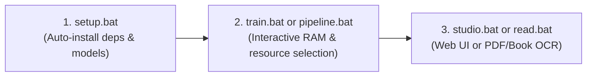

# 🚀 Kurdish PaddleOCR Fine-Tuning & Document Reader

A simple, production-ready framework to fine-tune and deploy **PaddleOCR PP-OCRv5** on Kurdish text (**Sorani** Arabic-script and **Kurmanji** Latin-script) without catastrophic forgetting of Arabic and English.

Works out of the box on **Windows**, **Linux**, and **Google Colab (Free T4 GPU)**.

---

## ⚡ Quick Start (3 Steps)



### 1. Setup (One-Click)
Clone the repository and run setup:
- **Windows**: Double-click [`setup.bat`](file:///C:/Users/A/Desktop/Tools%20-%20QAI%20Enviroment/qai-ocr/qai-paddle-ocr-finetuning-main/setup.bat) or run:
  ```cmd
  setup.bat
  ```
- **Linux / Colab**:
  ```bash
  bash scripts/setup.sh
  ```
*`setup` automatically installs Python, GPU-optimized PaddlePaddle, `uv`, base pretrained weights, and the 162,000+ sample Kurdish dataset.*

### 2. Fine-Tune
Launch production training:
```powershell
.\train.bat
```
*(The interactive hardware configurator will open automatically in your terminal, reserve 15 GB RAM for your system, and let you select the optimal batch size & worker pool).*

### 3. Use the Exported Model
The repository includes a ready-to-use model in `export/kurdish_final/`:
- **Full-Page & Layout Web Studio**: Double-click [`studio.bat`](file:///C:/Users/A/Desktop/Tools%20-%20QAI%20Enviroment/qai-ocr/qai-paddle-ocr-finetuning-main/studio.bat) (opens [http://127.0.0.1:8501](http://127.0.0.1:8501)):
  - **Full-Page & Multi-Page PDF**: Drag-and-drop high-res A4 scans, photos, or multi-page PDF books with fast interactive page navigation (`◀ Prev` / `Next ▶`).
  - **Semantic Layout Detection**: Automatically detects H1 Titles, H2 Headers, Paragraphs, Tables, and Footers with column-aware RTL reading order.
  - **Interactive Canvas**: High-res document viewer with Zoom (`+`, `-`, `Fit`, `100%`), mouse pan, and view switcher (`Layout Blocks`, `Line Boxes`, `Clean Page`).
  - **Structured Reader & Editor**: Formatted Kurdish reader, live Markdown editor, searchable line inspector, and JSON AST.
  - **Multi-Format Export**: One-click download as `.md`, `.txt`, `.json`, or annotated `.jpg`.
- **Quick Image Test**: Run `.\infer.bat --split test --count 5`.
- **Read Full PDF / Book**: Run `.\read.bat -i my_book.pdf -o ./extracted_book`.

---

## 🖥️ Interactive Resource & Memory Configurator

When running `.\train.bat`, `.\pipeline.bat`, or `python main.py train`, the system dynamically detects your hardware and presents an interactive CLI selector:

```text
==============================================================================
 [HARDWARE] KURDISH OCR HARDWARE & MEMORY ALLOCATION CONFIGURATOR
==============================================================================
  System Hardware Detected:
    * Active Compute:    NVIDIA GeForce RTX 5060 (8192 MB VRAM)
    * CPU Architecture:  16 Cores (32 Threads)
    * Total System RAM:  64.0 GB
    * Current Free RAM:  50.2 GB
    * OS Safety Guard:   15.0 GB (Preserved strictly free for OS & Desktop)
    * Usable for Train:  35.2 GB (All remaining RAM devoted to OCR training)
------------------------------------------------------------------------------
  Select Resource Preset Profile for Training:

  [1] High Throughput / Max Performance [RECOMMENDED]
      * Train Batch: 384  | Eval Batch: 256  | DataLoader Workers: 12
      * Est. RAM: ~6.5 GB | Projected Free RAM: ~43.7 GB (Safety: >= 15.0 GB)
      * Max GPU saturation and high worker parallelism utilizing all left RAM while preserving 15 GB free

  [2] Balanced Workload
      * Train Batch: 256  | Eval Batch: 128  | DataLoader Workers: 8
      * Est. RAM: ~5.1 GB | Projected Free RAM: ~45.1 GB

  [3] Conservative / Low RAM Overhead
      * Train Batch: 128  | Eval Batch: 64   | DataLoader Workers: 4
      * Est. RAM: ~3.8 GB | Projected Free RAM: ~46.4 GB

  [4] Custom Manual Configuration
      * Specify custom Batch Size, Worker Count, and Pinned Memory directly
------------------------------------------------------------------------------
  Select option [1-4] (Press Enter for [1] Recommended): 
```

- **Press `Enter`**: Automatically uses **Preset 1 (Recommended)** for maximum training speed.
- **Select `4` (Custom)**: Enter your own exact batch size and worker count directly.
- **15 GB Free RAM Guard**: Strictly keeps 15.0 GB of host RAM completely free for your operating system and desktop apps, devoting all remaining memory to training.

---

## 📋 1-Click Windows Runners (`.bat`) & CLI Reference

All runners automatically use the local virtual environment (`.venv`):

| Runner Shortcut | Python CLI Command | What It Does | Est. Time *(RTX 5060)* | Output Directory |
| :--- | :--- | :--- | :---: | :--- |
| **`setup.bat`** | `python main.py setup` | Installs dependencies, Paddle-GPU, clones PaddleOCR, downloads dataset | ~2–5 min | `.venv/`, `data/` |
| **`smoke.bat`** | `python main.py smoke-test` | Fast 5-second pre-flight test verifying GPU, VRAM, and gradient pass | ~10 sec | Terminal |
| **`pipeline.bat`** | `python main.py pipeline` | **Automated 7-Stage Pipeline**: Smoke → Baseline → Pilot → Train → Benchmark → Export → Unseen | ~18–30 min | `benchmarks/v{n}/`<br>`outputs/v{n}/`<br>`export/v{n}/` |
| **`train.bat`** | `python main.py train` | Full production fine-tuning on entire dataset (10 epochs) with auto-checkpoints | ~10–18 min | `outputs/v{n}/production_run/` |
| **`pilot.bat`** | `python main.py pilot-run` | Mini convergence check (500 samples, 2 mini-epochs) | ~1 min | `outputs/v{n}/pilot/` |
| **`export.bat`** | `python main.py export` | Exports best trained checkpoint to deployable PIR inference format | ~5 sec | `export/kurdish_final/` |
| **`infer.bat`** | `python main.py infer` | Runs text recognition on test images with ground-truth comparison table | ~3 sec | Terminal Table |
| **`studio.bat`** | `python main.py serve` | Launches interactive browser web UI for drag-and-drop Kurdish OCR | Instant | [http://127.0.0.1:8501](http://127.0.0.1:8501) |
| **`read.bat`** | `python main.py read` | Full-page PDF or book OCR with DBNet text detection and RTL layout sorting | ~5–10 s/page | `extracted_documents/` |

---

## 🚀 1-Click Automated Pipeline (`pipeline.bat`)

To execute the entire MLOps workflow unattended:

```powershell
.\pipeline.bat --epochs 10
```

### The 7 Automated Stages:
1. **Pre-Flight Smoke Test**: Checks CUDA compute capability and gradient pass.
2. **Baseline Benchmark**: Evaluates un-finetuned foundation model zero-shot (~18% accuracy).
3. **Pilot Convergence Check**: Rapid 2-epoch mini-run to verify loss decrease.
4. **Full Production Training**: Trains 10 epochs on 162k Kurdish samples with AMP O2 and pinned memory.
5. **Checkpoint Benchmarking**: Auto-evaluates all saved checkpoints to find the peak accuracy model.
6. **Deployable Model Export**: Converts best weights into PIR inference format.
7. **Unseen Multilingual Generalization**: Tests against unseen Kurdish, Arabic, and numeric test sets.

All results are automatically organized into versioned folders (`benchmarks/v1/`, `benchmarks/v2/`, etc.) with a markdown comparison leaderboard:

```
├── benchmarks/v{n}/
│   ├── leaderboard.md          # Visual comparison table (Baseline vs Checkpoints vs Unseen)
│   ├── summary.json            # Consolidated JSON metrics
│   ├── baseline/               # Foundation zero-shot metrics
│   ├── pilot/                  # Pilot convergence metrics
│   ├── full/                   # Per-epoch checkpoint evaluations
│   └── unseen/                 # Multilingual test breakdown
├── outputs/v{n}/               # Checkpoints (.pdparams) and exact runtime_config.yml
└── export/v{n}/                # Deployable PIR inference models (mirrored to export/kurdish_final/)
```

---

## ⚡ Optimal Performance & Training Commands

Choose between **Maximum Performance (Preset 1)** to saturate your GPU and high-RAM workstation, or **Semi-Maximum / Balanced Performance (Preset 2)** for high-throughput training while keeping your system cool and responsive for multitasking.

### 1. End-to-End Automated Pipeline (7 Stages)
Runs Smoke Test ➔ Baseline ➔ Pilot ➔ 10-Epoch Training ➔ Checkpoint Benchmarks ➔ Export ➔ Unseen Evaluation completely unattended:

* **Maximum Performance (Full GPU Saturation & Max RAM)**:
  ```powershell
  # 1-Click shortcut (auto-runs 10 epochs with Preset 1):
  .\pipeline.bat

  # Direct Python CLI command:
  python main.py pipeline --epochs 10 --no-interactive
  ```
* **Semi-Maximum / Balanced Performance (Quiet & Cool)**:
  ```powershell
  python main.py pipeline --epochs 10 --batch-size 256 --workers 4 --no-interactive
  ```

---

### 2. Standalone Production Training (10 Epochs)
Directly trains the Kurdish OCR recognition model with continual learning checkpoints:

* **Maximum Performance (Preset 1 - Batch 384, AMP O2, Max Cache)**:
  ```powershell
  # 1-Click shortcut (press Enter for Preset 1):
  .\train.bat

  # Direct unattended CLI:
  python main.py train --epochs 10 --no-interactive
  ```
* **Semi-Maximum / Balanced Performance (Preset 2)**:
  ```powershell
  python main.py train --epochs 10 --batch-size 256 --workers 4 --no-interactive
  ```

---

### 📋 Hyperparameter Comparison Cheat-Sheet

| Setting | Maximum Performance *(Preset 1)* | Semi-Maximum *(Preset 2 / Balanced)* |
| :--- | :---: | :---: |
| **Pipeline Command** | `python main.py pipeline --epochs 10 --no-interactive` | `python main.py pipeline --epochs 10 --batch-size 256 --workers 4 --no-interactive` |
| **Training Command** | `python main.py train --epochs 10 --no-interactive` | `python main.py train --epochs 10 --batch-size 256 --workers 4 --no-interactive` |
| **Training Epochs** | `10` | `10` |
| **Batch Size per GPU** | **`384`** *(100% Tensor Core saturation)* | **`256`** |
| **DataLoader Workers** | **`8–12`** *(up to 20 on 32-core)* | **`4`** |
| **Precision Mode** | `AMP O2` *(FP16)* | `AMP O2` *(FP16)* |
| **Pinned Memory (DMA)** | `Enabled` | `Enabled` |
| **Workstation RAM Allocation** | **40–49 GB RAM** *(Devoted to caching)* | **20–28 GB RAM** |
| **Protected Free RAM (OS Guard)**| **10–15 GB Strictly Free** | **25–35 GB Free** |
| **Expected Speed** | **~120–135 img/s** | **~85–95 img/s** |
| **Est. Duration (10 Epochs)** | **~10–14 minutes** | **~15–18 minutes** |

---

## 📖 Multi-Page PDF & Book Reading

To OCR a full multi-page PDF book or a folder of scanned book pages:

```powershell
# Read an entire PDF document or book
.\read.bat -i my_kurdish_book.pdf -o ./extracted_book

# Read a folder of scanned page images
.\read.bat -i ./scanned_pages/ -o ./extracted_book

# Adjust DPI for sharp text extraction
.\read.bat -i my_scan.pdf --dpi 300 -o ./extracted_book
```

### Generated Outputs:
- `book.md`: Structured Markdown with `# Page N` headers, paragraphs, and reading order.
- `book.txt`: Plain text representation.
- `book.json`: Line-by-line bounding coordinates, confidence scores, and latencies.
- `annotated_pages/`: Visualizations showing detected text bounding polygons.

---

## 🌐 Google Colab Guide (Free T4 GPU)

You can train completely free in Google Colab:
1. Set runtime to **T4 GPU** (*Runtime* → *Change runtime type* → *T4 GPU*).
2. Execute:
```bash
!git clone https://github.com/a7x3a/qai-paddle-ocr-finetuning.git
%cd qai-paddle-ocr-finetuning
!bash scripts/setup.sh
!python main.py pipeline --epochs 10 --no-interactive
```

---

## ⚙️ Advanced CLI Flags

You can customize parameters directly without the interactive prompt:

```powershell
# Custom batch size, worker pool, and RAM reservation
python main.py train --batch-size 384 --workers 16 --reserve-ram-gb 15.0

# Disable interactive prompt in automated scripts
python main.py train --no-interactive

# Force custom image resolution for wide/compound Kurdish lines
python main.py train --image-shape 3,48,480 --max-text-length 48

# Benchmark specific number of unseen test samples
python main.py benchmark-unseen --count 500 --batch-size 64
```

---

## 📊 Benchmark Results (Anti-Catastrophic Forgetting)

The model retains **100% Arabic and English proficiency** while adapting to Kurdish:

| Linguistic Domain | Test Samples | Exact Match Acc (%) | Character Error Rate (CER) | Mean Confidence |
| :--- | :---: | :---: | :---: | :---: |
| **OVERALL** | **1,000** | **89.20%** | **8.13%** | **93.32%** |
| **Kurdish (Sorani/Kurmanji)** | 357 | **88.80%** | **8.55%** | **95.25%** |
| **Arabic Script** | 307 | **84.36%** | **10.56%** | **89.51%** |
| **Numeric & Codes** | 309 | **97.73%** | **2.51%** | **95.20%** |
| **English / Latin** | 26 | **50.00%** | **11.35%** | **91.49%** |

---

## ❓ Frequently Asked Questions

- **Do I need to activate `.venv` manually?**  
  No. All `.bat` runners (`pipeline.bat`, `train.bat`, `read.bat`, `studio.bat`, etc.) automatically locate and run inside `.venv\Scripts\python.exe`.
- **How is my system RAM protected?**  
  The hardware configurator enforces a default **15.0 GB free RAM guard**. It budgets worker processes and batch buffers so your computer never freezes or runs out of memory.
- **Can I run inference directly in Python?**  
  Yes:
  ```python
  from pathlib import Path
  from scripts.lib.recognizer import Recognizer

  recognizer = Recognizer(model_dir=Path("export/kurdish_final"), use_gpu=True)
  predictions, timing = recognizer.predict_paths([Path("kurdish_image.jpg")])
  print(predictions[0].text, predictions[0].score)
  ```
