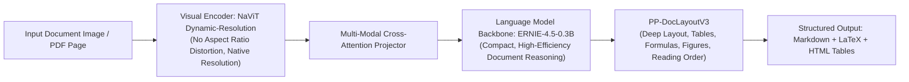

# 🚀 PaddleOCR-VL (Vision-Language Model) Branch Guide

> **Branch Purpose**: This branch (`paddleocr-vl`) is completely isolated from the `main` branch. 
> - **`main` Branch**: Discriminative 2-stage OCR (**PP-OCRv5**: DBNet text detection + SVTR Kurdish recognition). Ultra-lightweight (7.5 MB), 300+ img/s, ideal for fast character-level word/line OCR and scanned books.
> - **`paddleocr-vl` Branch**: Multimodal Generative Document Parsing (**PaddleOCR-VL 0.9B / 1.5 / 1.6**). Transforms entire complex pages into Markdown, LaTeX formulas, and structured HTML tables using a Vision-Language Model.

---

## 1. What is PaddleOCR-VL? (Architecture Breakdown)

PaddleOCR-VL is a compact, high-efficiency **0.9-billion parameter Vision-Language Model (VLM)** designed specifically for document and multimodal text intelligence:



### Core Components:
1. **Dynamic Visual Encoder (NaViT-Style)**:
   - Unlike standard ViTs that resize or crop images to fixed squares (e.g. 224x224 or 384x384), NaViT preserves native document aspect ratios with dynamic visual token packing.
2. **Language Backbone (ERNIE-4.5-0.3B)**:
   - A specialized 0.3B parameter LLM optimized for multilingual reasoning, document understanding, and Markdown generation across 109+ languages.
3. **PP-DocLayoutV3 (Layout Parsing)**:
   - Identifies complex document zones: multi-column text blocks, headers, footers, footnotes, images, tables, formulas, and seals/stamps.
4. **Benchmark SOTA**:
   - **PaddleOCR-VL-1.5**: 94.5% accuracy on OmniDocBench v1.5 with seal recognition and irregular boundary support.
   - **PaddleOCR-VL-1.6**: **96.3% accuracy** on OmniDocBench v1.6 using region-aware data optimization.

---

## 2. Official Documentation Reference

This implementation follows the official PaddleOCR v3.x documentation:
- **CLI Pipeline Usage**: [PaddleOCR-VL Usage Tutorial](https://www.paddleocr.ai/main/en/version3.x/pipeline_usage/PaddleOCR-VL.html#21-command-line-usage)
- **NVIDIA Blackwell & Modern GPUs**: [PaddleOCR-VL NVIDIA Blackwell GPUs Tutorial](https://www.paddleocr.ai/main/en/version3.x/pipeline_usage/PaddleOCR-VL-NVIDIA-Blackwell.html)
- **Algorithm & Release 1.6**: [PaddleOCR-VL-1.6 Algorithm Report](https://www.paddleocr.ai/main/en/version3.x/algorithm/PaddleOCR-VL/PaddleOCR-VL-1.6.html)

---

## 3. Official Command-Line Usage (CLI)

### 1. Document Parsing via CLI (`doc_parser`)
```bash
# Parse a document image to Markdown
paddleocr doc_parser -i ./document.png --save_path ./output_vl

# Parse a multi-page PDF book/document
paddleocr doc_parser -i ./kurdish_report.pdf --save_path ./output_vl

# Use Transformers inference engine backend
paddleocr doc_parser -i ./document.png --engine transformers --save_path ./output_vl
```

### 2. High-Performance Deployment (vLLM / Docker)
For production environments and modern NVIDIA GPUs (RTX 40-series and Blackwell RTX 50-series):
- **vLLM Serving**: Provides continuous batching, PagedAttention, and FP8/BF16 tensor parallelism.
- **Docker Compose**: Recommended official deployment method to avoid CUDA driver collisions.

---

## 4. Hardware Support: NVIDIA Blackwell & Ada Lovelace

- **Blackwell (RTX 50-series / B200 / GB200)**: Requires CUDA 12.9+, paddlepaddle-gpu 3.4.0 (cu129), or Docker container with vLLM engine.
- **Ada Lovelace (RTX 40-series like RTX 4050/4060/4090)**: Supported natively with CUDA 12.6, BF16/FP16 mixed precision.
- **VRAM Requirements**:
  - Model weights: ~1.8 GB (0.9B in FP16/BF16).
  - Runtime VRAM: 4 GB to 6 GB recommended for full document context.

---

## 5. Clean Git Separation (Never Mixing Codebases)

To keep your codebases 100% clean and unpolluted:

```bash
# Switch to PP-OCRv5 fine-tuning (Discriminative, Fast Line OCR):
git checkout main

# Switch to PaddleOCR-VL (Generative Multimodal Document Parser):
git checkout paddleocr-vl
```
